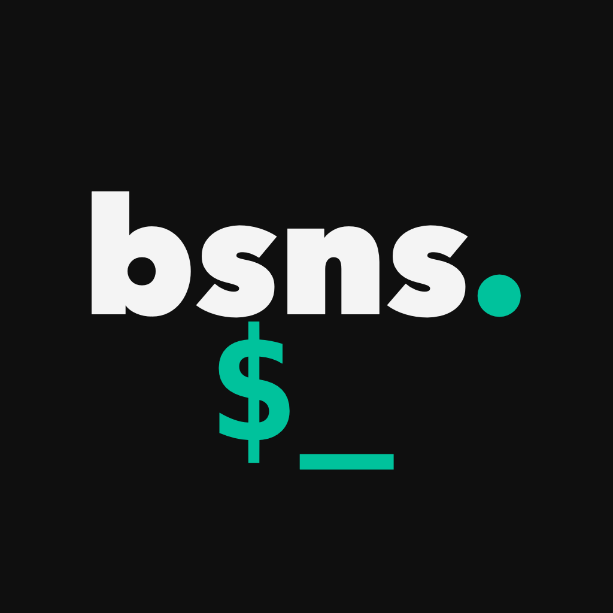
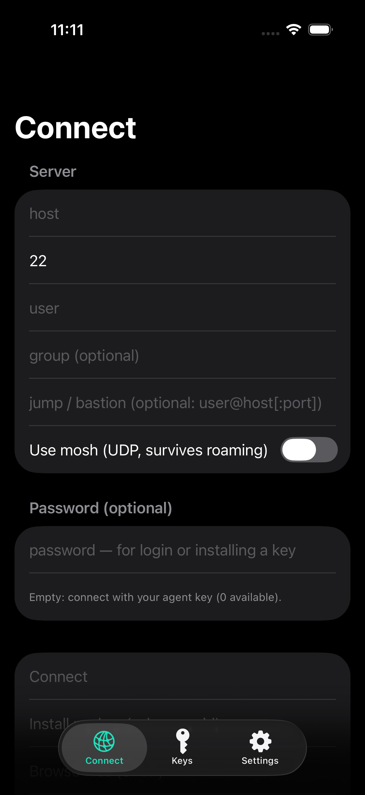

<p align="center">
  
</p>

<h1 align="center">bsns.SSH</h1>

<p align="center">
  A native iOS &amp; Android SSH/mosh client — <strong>your keys and config are
  yours, hardware-protected, with no vendor ever in the middle.</strong>
</p>

<p align="center">
  <strong>📱 Pending App Store &amp; Google Play review — available soon.</strong>
</p>

<p align="center">
  
</p>

---

- **Hardware-backed, non-extractable keys** — generated in and never leaving the
  Secure Enclave (iOS) or the Android Keystore / StrongBox, or held on a YubiKey
  (PIV, over NFC or USB-C). The private key never touches the SSH transport.
- **Encrypted config sync over storage you control** — it writes through native
  OS file providers (iOS Files / Android Storage Access Framework), so iCloud
  Drive, Google Drive, Dropbox, Nextcloud, Proton Drive, or a plain network share
  all work with **no third-party API tokens granted to the app**. The provider
  only ever sees ciphertext — no account, no server of ours.
- **No telemetry, no analytics, no phone-home.** The only network traffic is
  your own SSH/mosh connections and your own chosen sync storage — and you can
  confirm it yourself ([docs/no-telemetry-verification.md](docs/no-telemetry-verification.md)).
  We collect nothing: [Privacy Policy](PRIVACY.md).
- **Migrate in seconds** — import your existing `~/.ssh/config`, `known_hosts`,
  and keys.
- **Accessibility** — VoiceOver-labeled controls, Dynamic Type, and a
  high-contrast dark palette across the UI. (A VoiceOver-readable *terminal* —
  rare in this category — is on the roadmap.)

## Status

Active development, approaching a first release, on **both iOS and Android**
(feature parity). Implemented: SSH over libssh2 (authenticating through an
in-process agent, so the key never touches the transport), Secure Enclave /
Android Keystore + YubiKey (PIV) keys, software keys with encrypted config
export + sync, a multi-session tabbed terminal with find/scrollback, local port
forwarding, single-hop jump-host / ProxyJump for the interactive shell (the
bastion is key-authenticated and host-key-verified; mosh, SFTP, port forwarding,
and key install run direct and are disabled through a jump host for now),
snippets, local command history, SFTP, and a
mosh (UDP, roaming) transport. The SSH stack is built on a current, supported
crypto backend (OpenSSL 3.5 + libssh2 1.11), compiled reproducibly from pinned
source on both platforms.

## Building

The device-independent core (key handling, SSH agent, wire codec, crypto
envelope) builds and tests with no device — and is held byte-identical across
platforms by shared parity vectors:

```sh
swift test                            # iOS/macOS core (Swift)
cd android && ./gradlew :core:test    # Android core (Kotlin)
```

The **iOS** app target lives under `app/` (generated by XcodeGen); the **Android**
app under `android/` (Gradle, with the libssh2 / OpenSSL / mosh transport built
from source via the NDK). See [docs/ARCHITECTURE.md](docs/ARCHITECTURE.md) for the
layout and [android/README.md](android/README.md) for the Android modules.

## Why is this free?

bsns.SSH is built and maintained by [bsns.cc](https://bsns.cc), an operations
platform for operators. We build and run on these tools ourselves, and we think
foundational admin and security tooling should be open, private, and free. No
catch: the app collects nothing, has no ads, and never upsells inside the app —
it's free and open-source as a showcase of how we build. If it earns your trust,
bsns.cc is where the rest of our work lives.

## License

[GPLv3](LICENSE). The app links [mosh](https://mosh.org) (GPL-3.0), so the
combined work is GPLv3. See [THIRD-PARTY-NOTICES.md](THIRD-PARTY-NOTICES.md) for
the full dependency stack and mosh's App Store distribution exception.
